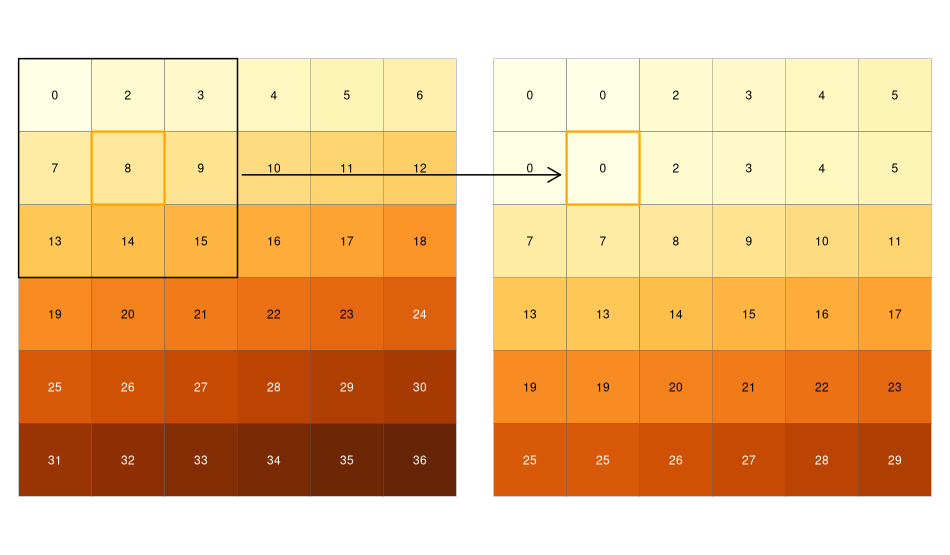

```{r}
library(tidyverse)
library(terra)
library(sf)
library(tmap)
```


### Let's read a raster image   

```{r}
myras <- terra::rast("../week12_inclass/ts_2016.1007_1013.L4.LCHMP3.CIcyano.MAXIMUM_7day.tif")

#has two main raster types: raster and vector (spatraster and spatvector)
```

plot it
```{r}
plot(myras)
```


### Basic properties

```{r}
#UTM - Universal Transverse Mercator, based on datum and projection. UTM zones look trapezoidal from the equator up/down. It tries to have every single measurement in the north or south. Everything can be measured as an easting or northing --> always positive units. Southern hemisphere is a little different

terra::ext(myras) #extent of the raster, in UTM coordinates

terra::nlyr(myras) #number of layers

terra::ncol(myras) #number of columns

terra::nrow(myras) #number of rows

terra::ncell(myras) #number of cells (rows x columns)

res(myras) #cell resolution

# to demonstrate rows * columns = cells
ncol(myras) * nrow(myras) == ncell(myras)

```

### QUESTION: what's the data structure of a raster file?
-Need to define the cell size or resolution
-Raster cells do not have to be square, they can be rectangular. Usually end up getting downsampled to squares to be on our computer anyways

Get values by index
```{r}
myras[1] #asking the raster for the first value


myras[33961]

```

### Or by row, column
```{r}

#[row, column]  
myras[132, 164]
```

### Two questions:

1. How is "single indexing" different than row, column indexing?


2. For (row, column) indexing, what other information is useful/required to know what you're doing?
- To index this, you also need to know the origin to be able to call the row/columns correctly


### Frequency of values 
```{r}
# Gives a table of values, a frequency table
terra::freq(myras)
  

```
What's the output???


### Let's plot the distribution of values


```{r}
terra::freq(myras) %>%  #use frequency table
  ggplot(., aes(x = value, y = count)) +
  geom_bar(stat = "identity") #whatever number in the y axis, make the bar that tall
```

Was the plot useful? Why or why not?


### Let's try again
```{r}
terra::freq(myras) %>%
  dplyr::filter(value < 252) %>% #getting rid of the skew
  ggplot(., aes(x = value, y = count)) +
  geom_bar(stat = "identity")
```
Better?


Why not just use an actual histogram?
--- Histogram is actually counting the number of values that fall within a range, it often over simplifies 

```{r}
terra::freq(myras) %>% #not good for frequency tables
  dplyr::filter(value < 252) %>% 
  ggplot(., aes(x = value)) +
  geom_histogram()
```
So, why NOT just use a histogram?

### Another way to "get" cell values
```{r}
myras %>% terra::values(.) %>% #values gives us all the values within the raster
  head(10) #first 10 numbers
```
Perhaps not the most useful for printing to the console, but does demonstrate how to access raw data values

## Raster aggregation

### What are some possible reasons we might want to change the resolution of a raster?
-- Make them orthogonal aka having the same resolution
-- Reduce the processing power (aggregate up) by losing information


Let's break down the code
```{r}
#using a function called aggregate by using some neighborhood of cells and turning the resolution into just 1 cell
terra::aggregate(myras, 2, fun = max) #aggregating by the factor of 2

#you can take minimum, mean, median, max value etc
```

What happened?


More obvious comparisons

```{r}
terra::aggregate(myras, 2, fun = max) %>% plot() #max of 4 pixels
terra::aggregate(myras, 5, fun = max) %>% plot() #max of 25 pixels
```

Interpret the results. How do they differ in spatial scale, generalization, etc.?


Different functions lead to different results

```{r}
raster::aggregate(myras, 5, fun = max) %>% plot() #less information than mean
raster::aggregate(myras, 5, fun = mean) %>% plot()
```

Again, how do they differ?
-- mean of 25 pixels means that we won't have integers, so the mean will have a continuous scale bar

## Data conversions

Let's turn some cells into points
```{r}
 myras %>% terra::as.points()
```
What's the data structure returned?


Maybe try plotting it?

```{r}
myras %>% terra::as.points() %>% plot() #point simplification is just too much so all of the points are overlapping each other
```

What are we seeing?

We can also polygonize (if we'd like)

```{r}
 #we can transform grid cells into polygons too
poly1 <- terra::as.polygons(myras, dissolve = T) #dissolve means that two cells that are next to each other have the same value, they merge and if they are different they become new polygons

tmap_mode("view")
tm_shape(poly1) + tm_polygons() #same areas look like regions others just as cells
```

Zoom in. What do you see? What was the result?


Might be more obvious if we aggregate first

```{r}
myras %>% 
  terra::aggregate(., 3, fun = max) %>% #we can aggregate up, lose info, values more similar
  terra::as.polygons(., dissolve = T) %>%
  tm_shape(.) + 
  tm_polygons()
```

Any questions?


## Map algebra 

Map algebra (or cartographic modeling) divides raster operations into four subclasses (Tomlin 1990), with each working on one or several grids simultaneously:

1. Local or per-cell operations
-- you are looking at each cell and you are not considering the neighbors of any given cell

2. Focal or neighborhood operations. Most often the output cell value is the result of a 3 x 3 input cell block
-- this is a neighborhood operation and done with just those surrounding cells. This is like queen contiguity

3. Zonal operations are similar to focal operations, but the surrounding pixel grid on which new values are computed can have irregular sizes and shapes
-- basically a fancy focal operation. Zone can be any shape and is often defined by a vector file (portage county could be a zone)

4. Global or per-raster operations; that means the output cell derives its value potentially from one or several entire rasters
-- what is the statistic across the entire data set


### Local operations

- Local operations comprise all cell-by-cell operations in one or several layers

- Raster algebra is a classical use case of local operations


### Let's try an example

```{r}
plot(myras)
```

A simple local operation

```{r}
myras * 2 
```

How might you "check your work"? How would you know if this operation worked?

Ideas?


We could verify the range of values

```{r}
myras %>% values() %>% range(na.rm = T) #we could calculate the range

# What's different here?
(myras * 2) %>% values() %>% range(na.rm = T) #compare these ranges
```

Other simple local operations:

```{r}
myras - 4
myras ** 2
log(myras)
```

...Essentially any algebraic operation works


### Reclassify

first, we need to setup our reclassification scheme

```{r}
#We might want to say certain values are out of bounds
#this means you are doing 0-1 as 0, 2-249 as 1, 250-256 as 0
rcl = matrix(c(0, 1, 0, 2, 249, 1, 250, 256, 0), ncol = 3, byrow = TRUE)
rcl #this ends up making it a binary raster
```
Question: are they inclusive or exclusive ranges?
-- are 0 and 1 in the interval? Here, they are
-- what happens if there is a value between 1 and 2. In this case, they are integers

Next, apply it

```{r}
#new raster with the classified data
validdata = terra::classify(myras, rcl = rcl) #asks for raster and reclassification table
validdata

#NA values are 0
plot(validdata)
```
How might this (essentially binary) raster be useful?
-- could be useful for land, clouds, etc


Let's multiply our "valid" raster with the original. What's your expected output?
```{r}
#create a brand new raster with only the valid data point
validRaster <- myras * validdata  #keeps original data point within valid range

plot(validRaster)
```
What was our result?


### We can "do algebra" using a function too!

DN= Digital Numbers, this is what comes off the satellite. These are just scaled numbers on an 8 bit integer scale. You can transform this into something useful
```{r}
# NOAA transform for CHAMPLAIN data
# valid as of 2019-02-01 metadata
transform_champlain_olci <- function(x){
  
  10**(((3.0 / 250.0) * x) - 4.2) #nonlinear response of DN values
}

myras.ci <- validRaster %>% transform_champlain_olci()

#Now we are seeing the valid cholorphyll values
plot(myras.ci)
```

## Focal operations

- Focal operations take into account a central (focal) cell and  neighbors
- The neighborhood (also named kernel, filter, or moving window) can be any size/shape, but commonly a 3x3 grid
- operation applies aggregation function to all cells within the specified neighborhood
- function output is the new value for the the central cell, and moves on to the next central cell
-helps to smooth out those values


*`(from https://geocompr.robinlovelace.net/spatial-operations.html#map-algebra)`*

### An example

Let's break down the code

How does it work conceptually?
```{r}
#function call focal: takes original raster, makes a W matrix 
myras_focal = 
  terra::focal(myras.ci, 
               w = matrix(1, nrow = 3, ncol = 3), #3x3 matrix, weighted as 1
               fun = max) #doing the max

#maintains the original resolution or grid size (aggregate does not)
plot(myras_focal)
```

Before we run it, how does this function differ from `aggregate` that we used earlier?

What does the new raster look like?

How might we know what actually changed?

### Change detection

```{r}
#subtract the new raster from the old raster
(myras_focal - myras.ci) %>% plot
```

What assumptions does the comparison make?
-- make sure they are orthogonal
--- matching extents, crs, centroid positions

### Good practice is to verify same extent, projection, resolution, and origin

```{r}
terra::compare(myras_focal, myras.ci, "==")
```

## Global operations (are boring)

```{r}
myras.ci %>% terra::global(., "max", na.rm=TRUE)
myras.ci %>% terra::global(., "min", na.rm=TRUE)
myras.ci %>% terra::global(., "mean", na.rm=TRUE)
```

or
```{r}
myras.ci %>% terra::values() %>% mean(na.rm = T)
```

## Questions?


# Your task with the remaining time

Tell me how large the cyanobacteria bloom is in `myras`. I have shown you everything you need to know
```{r}
#count of pixels in valid data
terra::freq(validdata) #815 with value 1

#multiply cells
bloom_area <- 815 * 90000
bloom_area
```

1. Think through the problem CONCEPTUALLY
2. THEN once you have the process figured out, write the code
3. Compare your answer with your classmates'